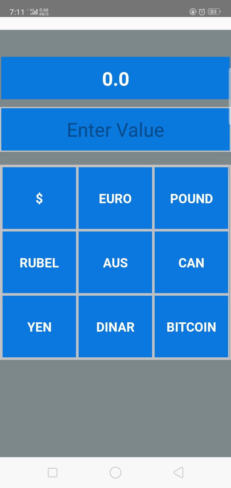
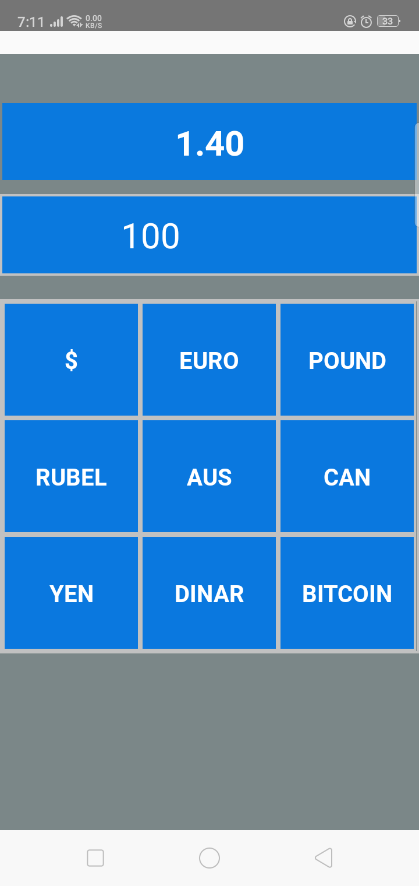

# Currency Converter React_Native 
Covert Indian currency to Diffrent currency

## ScreenShots

### Tools
| Name             | Description   |
| :-------------:|--------------|
| React_native |  JavaScript library for building cross platform native application |

### Requirements
- [Node](https://nodejs.org/)
- [npm](https://npmjs.com) 
- [react-native](https://facebook.github.io/react-native/)
- [expo](https://expo.io/)

## Installation

1. Clone the repo
2. `cd Currency_Converter_React_Native  `
3. Install Expo : ` npm install -g expo-cli`
4. Install packages: `npm install` 
5. Run Project: `npm start`
6. Open your browser at: `http://localhost:port`

